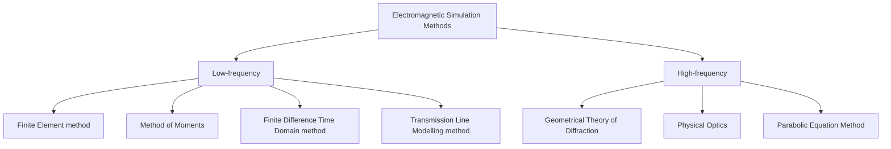

```mermaid
graph TD
A[Electromagnetic Simulation Methods]
A -->  B[Low-frequency]
A -->  C[High-frequency]
B -->  D[Finite Element method]
B -->  E[Method of Moments]
B -->  F[Finite Difference Time Domain method]
B -->  G[Transmission Line Modelling method]
C -->  H[Geometrical Theory of Diffraction]
C -->  I[Physical Optics]
C -->  J[Parabolic Equation Method]
```
