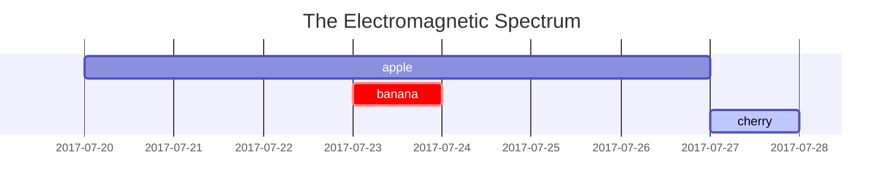
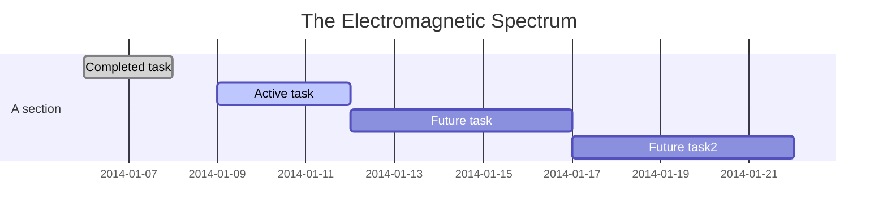

% High Frequency Communication Systems
% Hasan Tahir Abbas \& Qammer Abbasi
% Spring 2021

# Preliminary Information

## Course Introduction


- Introduction to Millimetre wave (mmWave) and Terahertz (THz) Frequency Communication Systems
- Theory of Electromagnetic wave propagation
- Channel Modelling Schemes
- Antenna Analysis and Design


## Course Objectives


- State of the art of electromagnetic simulation strategies for THz devices
- Application of solid-state structures and novel 2D materials in mmWave and THz device 	technologies
-	Antenna design with emphasis on phased arrays used for beamforming
-	Wireless Propagation models of mmWave and THz communication channels

## Course Intended Learning Outcomes

By the end of this course, you will be able to:

1. Recognise the physical limitations of electromagnetic wave propagation and the need to move to higher frequencies in next generation mobile communication.
2. Analyse the wireless channel models to characterise a cellular communication environment.
3. Use electromagnetic simulation techniques to study antennas and wave propagation.
4. Design complex antenna systems with specific beamforming needs for mobile environments.


## Course Assessments


| Assessment Type        | Weightage      |
| ------------- |:-------------:|
| Homework       | 30 %      |
| Final Exam       | 20 % |
| Lab Exercises | 20 %      |
| Lab Project and Presentation | 20 %      |


# The Electromagnetic Wave Spectrum

## Electromagnetic Waves
## TikZ picture

```latex {cmd=true hide=true}
\documentclass[border = 10pt]{standalone}
\usepackage{tikz}
\usetikzlibrary{timeline}
\usetikzlibrary{decorations.pathreplacing}
\usepackage{fontspec}
\setmainfont[BoldFont={Fira Sans}]{Fira Sans}
\setsansfont[BoldFont={Fira Sans}]{Fira Sans Light}
\setmonofont{Fira Mono}

\begin{document}
\begin{tikzpicture}[timespan={}]

\timeline[custom interval=true]{ RF,  $\mu$wave,  mmWave,  Sub-mmWave, THz}

\begin{phases}

%A RF
\phase{between week=1 and 2 in -0.5,involvement degree=2.25cm}
%C mu-wave
\phase{between week=1 and 2 in -0.1,involvement degree=2.25cm}
%R mmWave
\phase{between week=1 and 2 in 0.3,involvement degree=2.25cm}


%A 2016
\phase{between week=2 and 3 in 0,involvement degree=2.25cm,phase color=blue!80!cyan}
%C 2016
\phase{between week=2 and 3 in 0.4,involvement degree=2.25cm,phase color=blue!80!cyan}
%R 2016
\phase{between week=3 and 4 in 0.05,involvement degree=2.25cm,phase color=blue!80!cyan}


%A 2018
% \phase{between week=3 and 4 in 0.5,involvement degree=2.25cm,phase color=green!50!white}
%C 2018
\phase{between week=4 and 5 in -0.0,involvement degree=2.25cm,phase color=green!90!white}
%R 2018
\phase{between week=4 and 5 in 1.0,involvement degree=2.25cm,phase color=orange!90!white}


\end{phases}
%2014
\addmilestone{at=phase-1.90,direction=90:3.5cm,text={Radio},text options={above}}
% \addmilestone{at=phase-1.270,direction=270:1.5cm,text={Ionospheric},text options={below}}


\addmilestone{at=phase-2.90,direction=90:2.5cm,text={RF Ablation},text options={above}}
\addmilestone{at=phase-2.270,direction=270:2.5cm,text={MRI},text options={below}}


\addmilestone{at=phase-3.90,direction=90:1.5cm,text={Bluetooth},text options={above}}
\addmilestone{at=phase-3.270,direction=270:3.5cm,text={Wi-Fi},text options={below}}


%2016

\addmilestone{at=phase-4.90,direction=90:3.5cm,text={$\mu$wave Oven},text options={above}}
\addmilestone{at=phase-4.270,direction=270:1.5cm,text={Radar},text options={below}}


\addmilestone{at=phase-5.90,direction=90:2.5cm,text={Satellites},text options={above}}
\addmilestone{at=phase-5.270,direction=270:2.5cm,text={P2P Communications},text options={below}}


\addmilestone{at=phase-6.90,direction=90:1.5cm,text={Radio Astronomy},text options={above}}
\addmilestone{at=phase-6.270,direction=270:3.5cm,text={High-bandwidth Communications},text options={below}}


%2018

\addmilestone{at=phase-7.90,direction=90:2.5cm,text={Remote Sensing},text options={above}}
\addmilestone{at=phase-7.270,direction=270:2.5cm,text={Vehicular Radars},text options={below}}


\addmilestone{at=phase-8.90,direction=90:1.5cm,text={Imaging},text options={above}}
\addmilestone{at=phase-8.270,direction=270:3.5cm,text={Quantum Cascade Laser},text options={below}}

\draw [decorate, red, decoration = {brace, amplitude = 10pt, mirror, raise = 4pt}]
([yshift = -5cm]phase-1.180) -- ([yshift = -5cm]phase-3.0)
node [black, midway, yshift = -0.5cm, align = center] {300 MHz - 3 GHz};

\draw [decorate, blue, decoration = {brace, amplitude = 10pt, mirror, raise = 4pt}]
([yshift = -5cm]phase-4.180) -- ([yshift = -5cm]phase-6.0)
node [black, midway, yshift = -0.5cm, align = center] {3 GHz - 30 GHz};

\draw [decorate, orange, decoration = {brace, amplitude = 10pt, mirror, raise = 4pt}]
([yshift = -5cm]phase-7.180) -- ([yshift = -5cm]phase-8.0)
node [black, midway, yshift = -0.5cm, align = center] {This course (25 GHz - 10 THz)};


\end{tikzpicture}
\end{document}
```

-

- point to a location in memory
- declaration: `int *intPtr;`
- getting an address: `intPtr = &x;`
- "dereferencing" a pointer gets the value pointed to: `*intPtr`

## Pointer arithmetic







- In general, we cannot perform arbitrary assignments to a pointer and expect to read valid memory (often results in segfaults)
- Exception: we can add or subtract from a pointer to navigate an array
- Incrementing a pointer increments by `sizeof(type)` being pointed to, not by 1 memory address
